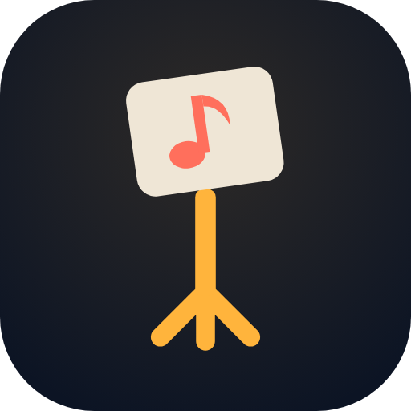
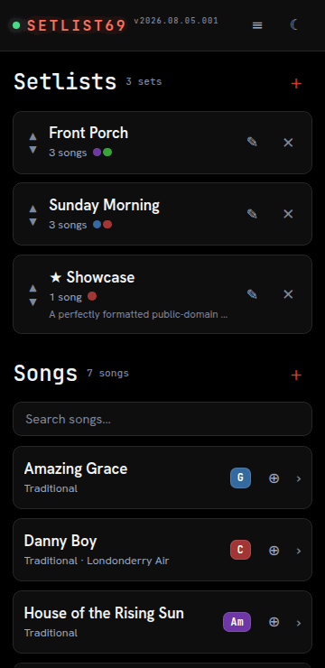
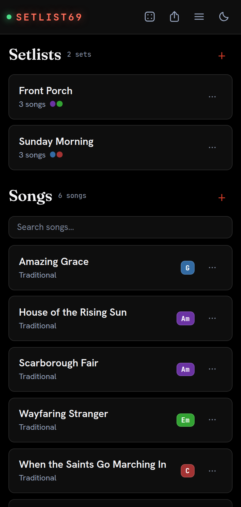
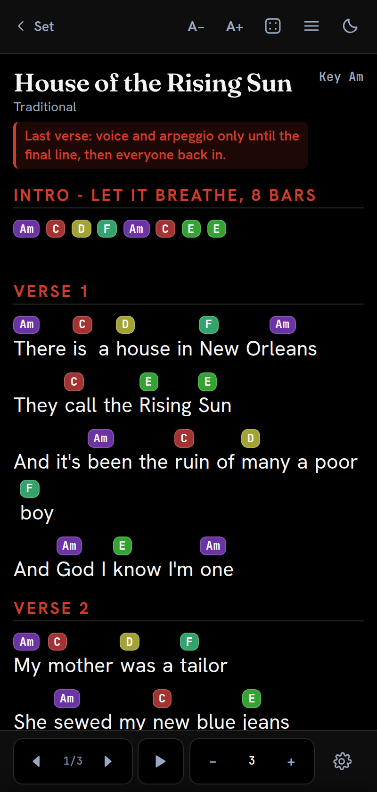
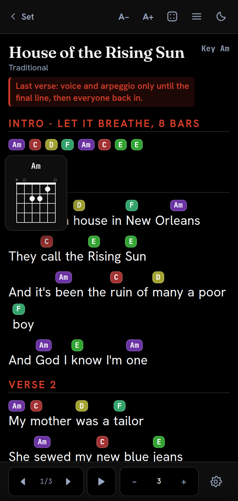
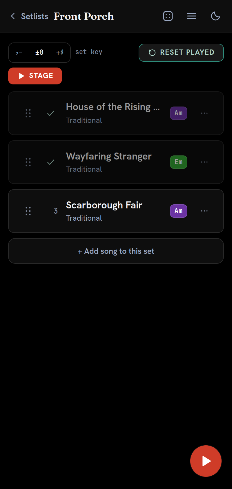
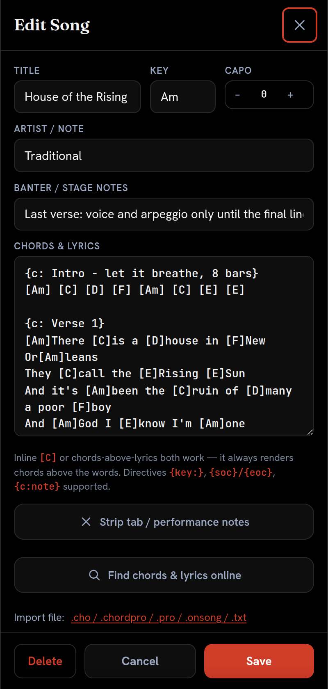
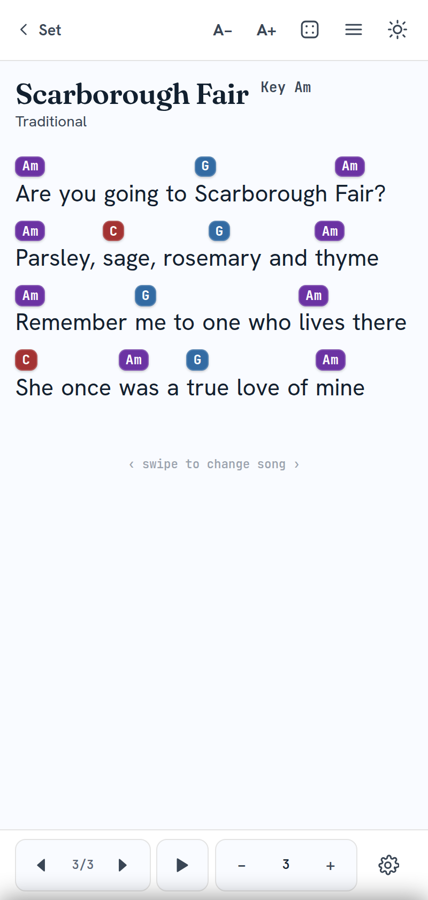
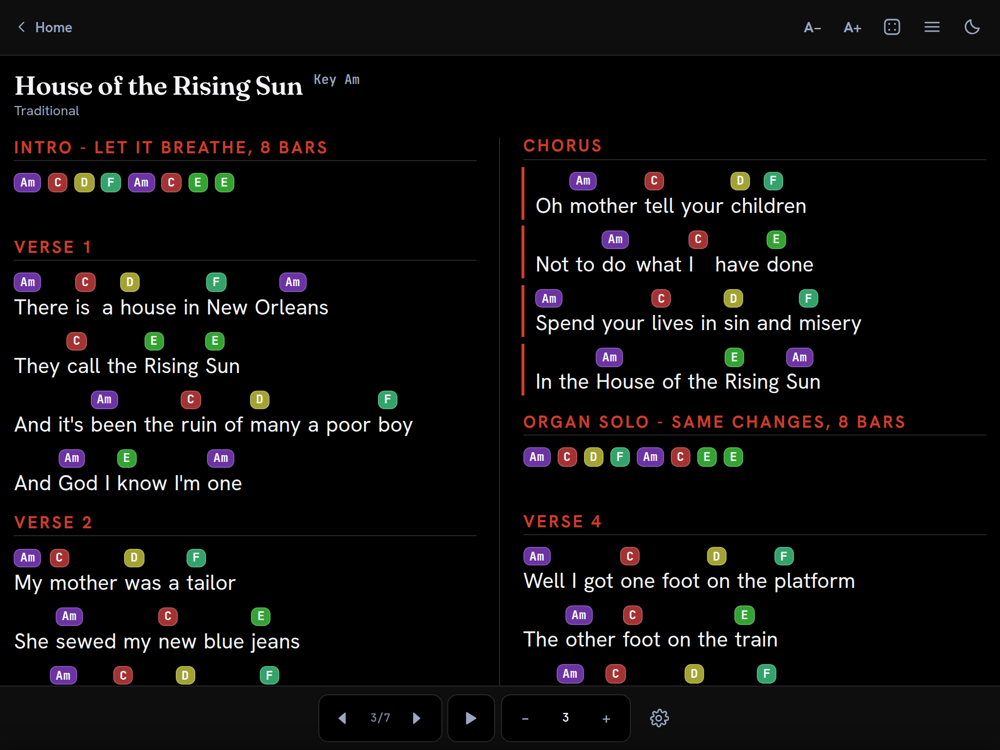

<div align="center">



# SetList69

### Your band's whole songbook — chords, lyrics and setlists — running offline on the phone clipped to your mic stand.

<br>

<a href="https://cdburgess75.github.io/SetList69/">
  
</a>

**No signup. No install. Loads once, then works with zero signal.**

<br>

[User Guide](docs/USER-GUIDE.md) · [Features](#features) · [Quick start](#quick-start) · [Save it to your phone](#save-it-to-your-phone) · [Tech stack](#tech-stack) · [Architecture](#architecture)

<br>



<sub><i>Open a set → tap a song → hands-free auto-scroll → tap any chord for the fingering.</i></sub>

<br>

[](https://github.com/cdburgess75/SetList69/actions/workflows/check.yml)
[](#versioning)
[](#save-it-to-your-phone)
[](#features)
[](#tech-stack)
[](LICENSE)

</div>

---

## What it is

SetList69 is an offline-first web app for performing musicians. It stores your songs as lyrics with chords, groups them into setlists, and renders them in a large, high-contrast view built to be read while your hands are busy playing.

It's the app you actually run the gig from. It **imports the library you already have** — OnSong, ChordPro, OpenSong and plain text all come straight in — and then keeps everything on your device. No account, no subscription, no cloud, nothing to lose when the venue's Wi-Fi doesn't exist.

The whole thing is a single `setlist69.html` file. No framework, no build step, no `node_modules`. You can read every line of it, fork it, and host it anywhere.

---

## Features

**On stage**

- **Auto-scroll that keeps your hands free** — starts at a tap, adjustable speed mid-song, with a progress bar and a haptic nudge when you reach the last line.
- **No chrome while you read** — the control dock hides itself; tap the lyrics when you need it and it gets back out of the way.
- **Never goes dark** — the app holds a screen-wake lock the whole time it's open, so the screen won't sleep between verses, songs, or sets.
- **Chord chart** — flip on a strip of fingering diagrams for every chord the song uses, straight from the ⚙ sheet.
- **Stage mode** — hides every editing control so nothing destructive is one fat-fingered tap away, and leaving a song mid-performance deliberately takes two taps.
- **Two columns on wide screens** — on a tablet or a phone held sideways, verses flow into side-by-side blocks (each verse kept whole), so most songs fit with little or no scrolling.
- **Swipe between songs** — in set order during a gig, or straight through your library when browsing, position (`3/12`) always visible.
- **🎲 Spin** — one tap opens a random song from your library, for practice nights when nobody can pick.
- **✓ Played marks** — songs cross off behind you as you play them, and survive a reload or a backgrounded phone.

**Chords and keys**

- **Chords sit on the right syllable** — a custom rendering engine locks each chord above the exact syllable it changes on, wraps to your screen width, never splits a word, and never scrolls sideways.
- **Transpose** per song (remembered next time) or across a whole set at once, with a ♯/♭ spelling toggle.
- **Capo support** — set the fret and chords redraw as the shapes your fingers actually make.
- **Tap any chord for a fingering diagram** — open voicings plus movable barre shapes, always matching what's on screen after transpose and capo.
- **Nashville numbers** — flip chords to scale degrees for the players who read that way.

**Your library**

- **Import what you already own** — ChordPro (`.cho`/`.chordpro`/`.pro`), OnSong (`.onsong`/`.txt`, including `Key:` and `Capo:`), OpenSong XML, plain chords-above-lyrics, and ZIP bundles of any of those.
- **Paste from the web** — a built-in helper opens the usual chord sites, and pasted text gets cleaned up and parsed automatically.
- **Songs are shared, not copied** — fix a typo once and every setlist using that song is fixed.
- **Share a single setlist** with a bandmate as one file that *merges* into their library instead of trampling it — matching songs are reused, not duplicated.
- **Back up everything** to plain, readable JSON that you own.

**Offline and yours**

- **Works with zero signal** — a service worker precaches every asset, fonts included, on first load.
- **Installs to your home screen** and launches like a native app. [How →](#save-it-to-your-phone)
- **No server, no account, no telemetry.** Your songs live on your device and move by file.
- **Dark and light themes**, both held at or above WCAG AA contrast, with real pinch-zoom and screen-reader labels throughout.

---

## Sending a song to a bandmate

Open a song → **⚙** → **Share this song** (or long-press it in the library). You get a link with the
whole chart — chords, sections, key, stage banter — packed into it. Text it, email it, AirDrop it.
Whoever opens it is asked whether to add it to their library.

Nothing is uploaded anywhere: the song rides in the URL's `#fragment`, which browsers never send to
a server. There's no account and no backend to sync through.

> **On an installed iPhone/iPad app,** open **≡ → Add a song from a link** and paste the link there.
> Tapping a link opens Safari, and iOS gives an installed home-screen app its own separate storage —
> so a tapped link would land in a copy of the app you don't use.

## Tech stack


No React, no Tailwind, no bundler — **the runtime dependency count is zero.** Everything below is either a browser API or a file served straight from this repo.

| Layer | What it uses |
|---|---|
| **App** | Hand-written HTML5, CSS (custom-property theming, flexbox/grid) and vanilla JavaScript (ES2017+), all in one `setlist69.html` |
| **Storage** | IndexedDB for the library with a `localStorage` fallback; state is structurally validated on load and persisted whole |
| **Offline / install** | Web App Manifest + a cache-first Service Worker precaching every asset; the Wake Lock API keeps the screen alive through a set |
| **Files / sharing** | File System Access API, Web Share API and an anchor-download fallback, chosen per platform at runtime |
| **Import** | ChordPro, OnSong and OpenSong XML parsers (the last via `DOMParser`); ZIP bundles unpacked with the native `DecompressionStream` |
| **Fonts** | Self-hosted WOFF2 (JetBrains Mono, Hanken Grotesk) — no CDN, so text renders identically offline |
| **Dev tooling** | Node.js `--check` for syntax, Playwright for the screenshots and hero GIF, GitHub Actions for CI, GitHub Pages for hosting — none of it ships to the browser |

---

## Quick start

> **Just want to use it?** You don't need any of this — [open the live app](https://cdburgess75.github.io/SetList69/) and you're done. This section is for running it locally or hosting your own copy.

### Prerequisites

| For | You need |
|---|---|
| Using the app | Any modern browser. That's it. |
| Running it locally | `git` |
| Regenerating the screenshots / hero GIF | Node.js ≥ 18 and Playwright *(optional)* |

### 1. Clone

```bash
git clone https://github.com/cdburgess75/SetList69.git
cd SetList69
```

### 2. Install

Nothing to install. There's no build step, no package manager and no dependencies — the app is static files.

The only optional install is the dev tooling that regenerates the visuals in this README:

```bash
npm install playwright gifenc pngjs   # optional — screenshots and hero GIF only
```

### 3. Run

Open `setlist69.html` in your browser directly, or serve the folder so the service worker and offline caching behave the way they will in production:

```bash
npx serve .
# → http://localhost:3000
```

### 4. Deploy your own

Push the repo to any static host — GitHub Pages, Netlify, Cloudflare Pages, or a folder on your own server. There's no build to run and nothing to configure. (`.nojekyll` is already in place so GitHub Pages serves the files as-is.)

---

## Save it to your phone

SetList69 installs to your home screen and runs fullscreen like a native app — no App Store, no account. This is how you'll actually want it at a gig.

<div align="center">

</div>

### 📱 iPhone / iPad — Safari

1. Open **[cdburgess75.github.io/SetList69](https://cdburgess75.github.io/SetList69/)** in **Safari**.
2. Tap the **Share** button (the square with the arrow pointing up).
3. Scroll down and tap **Add to Home Screen**.
4. Tap **Add**.

> It has to be Safari — Chrome on iOS can't install home-screen apps.

### 🤖 Android — Chrome

1. Open **[cdburgess75.github.io/SetList69](https://cdburgess75.github.io/SetList69/)** in **Chrome**.
2. Tap the **⋮** menu (top right).
3. Tap **Install app** — or **Add to Home Screen** on older versions.
4. Tap **Install**.

> Chrome often offers this on its own with an install banner along the bottom of the screen.

### 💻 Desktop — Chrome / Edge

Click the **install icon** (a monitor with a downward arrow) at the right-hand end of the address bar, then **Install**.

### After you install

- **Launch it once while you still have signal.** That's when it caches everything.
- From then on it opens fullscreen and works with **no connection at all** — airplane mode, basement venue, dead rural bar, doesn't matter.
- When a new version ships, the app slides down an **"Update ready"** banner naming it and keeps a **⟳** button in the header to apply it. It never reloads itself mid-song.

---

## Screenshots

<div align="center">
<table>
<tr>
<td width="50%"></td>
<td width="50%"></td>
</tr>
<tr>
<td align="center"><sub><b>Performance view</b> — chords locked to the syllable</sub></td>
<td align="center"><sub><b>Tap a chord</b> for its fingering</sub></td>
</tr>
<tr>
<td width="50%"></td>
<td width="50%"></td>
</tr>
<tr>
<td align="center"><sub><b>Set view</b> — songs cross off as you play them</sub></td>
<td align="center"><sub><b>Editor</b> — inline ChordPro, key and capo</sub></td>
</tr>
<tr>
<td width="50%"></td>
<td width="50%"></td>
</tr>
<tr>
<td align="center"><sub><b>Light theme</b> — for daylight gigs</sub></td>
<td align="center"><sub><b>Home</b> — setlists and the full library</sub></td>
</tr>
</table>



<sub><b>Two columns on tablets</b> — wide screens flow verses into side-by-side blocks automatically, so the whole song fits with little or no scrolling</sub>
</div>

---

## Architecture

```
SetList69/
├── setlist69.html          # The entire application — HTML, CSS and JS in one file
├── sw.js                   # Service worker: cache-first, precaches every asset
├── manifest.json           # PWA manifest (id, icons, screenshots, standalone)
├── index.html              # Redirect stub → setlist69.html
├── .nojekyll               # Tell GitHub Pages to serve the files as-is
├── fonts/                  # Self-hosted WOFF2 (Hanken Grotesk, JetBrains Mono)
├── icons/                  # App icons incl. an Android-maskable variant
├── docs/
│   ├── USER-GUIDE.md       # End-user walkthrough
│   ├── DEVICE-TESTING.md   # Manual test pass for touch/visual behaviour
│   ├── shots.js            # Playwright helper — regenerates the screenshots
│   ├── hero-gif.js         # Playwright helper — regenerates the hero GIF
│   └── screenshots/
└── .github/workflows/
    └── check.yml           # CI: syntax, version-match, duplicate-id, manifest checks
```

Inside `setlist69.html` the code reads top to bottom: persistence (IndexedDB + `localStorage` fallback) → seed data → music core (transposition, chord detection) → parsing and rendering engine → screen router → list renderers → import/export → event wiring.

A single in-memory `state` object holds everything and is persisted whole:

```js
state = {
  songs:    [{ id, title, sub, banter, key, capo, defaultTranspose, body }],
  setlists: [{ id, name, notes, setTranspose, songIds: [...] }],
  theme:    "dark"
}
```

Songs are a shared master store and setlists reference them by id, so editing a song updates every set that uses it. Deeper notes — the rendering pipeline, capo maths, merge-import rules — live in [`CLAUDE.md`](CLAUDE.md).

---

## Development

There's no unit-test framework by design. Correctness is enforced by CI checks plus small targeted Node harnesses when the music core changes.

```bash
# What CI runs on every push — syntax-check the extracted script and the worker:
node -e "const s=require('fs').readFileSync('setlist69.html','utf8').match(/<script>([\s\S]*?)<\/script>/)[1];require('fs').writeFileSync('/tmp/app.js',s)" \
  && node --check /tmp/app.js && node --check sw.js

# Regenerate the README visuals after a UI change (needs Playwright + Chromium):
node docs/shots.js        # the six screenshots
node docs/hero-gif.js     # the animated hero

# Touch and visual behaviour has to be checked on real hardware:
# → follow docs/DEVICE-TESTING.md
```

CI (`.github/workflows/check.yml`) also fails the build on a version mismatch, duplicate element ids, or a manifest referencing a missing precached file.

---

## Versioning

Revisions use **`vYYYY.MM.DD.NNN`**. Every app change bumps the version in three synced places — the changelog comment at the top of `setlist69.html`, the on-screen brand tag, and the `CACHE` constant in `sw.js`. CI fails the build if they drift. The full changelog lives at the top of [`setlist69.html`](setlist69.html).

---

## Contributing

A personal tool developed in the open. Issues and PRs are welcome:

1. Read [`CLAUDE.md`](CLAUDE.md) first — it documents the architecture, the rendering engine's invariants and the change checklist.
2. Keep the constraints: **vanilla JS, one file, zero runtime dependencies, no build step.**
3. Bump the version in all three places (CI will catch you if you don't).
4. `node --check` the extracted script, and add a small Node harness if you touch the music core.
5. Flag anything needing real-device testing (touch, share sheet, install flow) in your PR description.

---

## License

[MIT](LICENSE) — use it, fork it, self-host it, gig with it. Attribution is the only condition.

---

<div align="center">

**[▶ Open the live app](https://cdburgess75.github.io/SetList69/)**

<sub>Built for working bands. No cloud, no subscription, no ads — just your songs.</sub>

</div>

<!--
  VISUAL ASSET MAP — every image slot above, and what belongs in it.
  All paths are real files in this repo; drop a replacement at the same path and
  the README picks it up with no edits.

  icons/icon-512.png                  Hero logo. App icon, 512x512.
  docs/screenshots/demo.gif           Hero animation. 360x740, ~7s loop, 22 frames.
                                      Regenerate: node docs/hero-gif.js
  docs/screenshots/home.png           Home — setlists + song library.
                                      (used twice: "Save it to your phone" and the gallery)
  docs/screenshots/song.png           Performance view, dark theme.
  docs/screenshots/chord-diagram.png  Chord fingering popover.
  docs/screenshots/played.png         Set view with "played" marks.
  docs/screenshots/editor.png         Song editor.
  docs/screenshots/song-light.png     Performance view, light theme.
  docs/screenshots/twocol.png         Two-column sheet, iPad landscape (1024x768).
                                      Regenerate all seven: node docs/shots.js

  NOTE: manifest.json references home.png, song.png and played.png by path —
  renaming or removing those three breaks the PWA install screenshots.
-->
